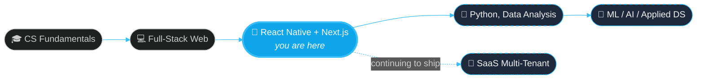

<h1 align="center">Hi 👋, I'm Mahesh Shrikrishna Kadam</h1>

  

  
  
  
  
  

---

### 👨‍💻 About Me

- 🔭 &nbsp;Currently building **React Native apps** and **Next.js web platforms** at work
- 🚀 &nbsp;Interested in **SaaS-based multi-tenant architectures**
- 🌱 &nbsp;Next up: diving into **Data, ML & AI** — exploring it alongside my day-to-day dev work
- 💡 &nbsp;I enjoy shipping things that solve real problems, not just demos
- 🌐 &nbsp;Portfolio → **[portfollio-five-bay.vercel.app](https://portfollio-five-bay.vercel.app/)**
- 📫 &nbsp;Reach me at **maheshkadam9298@gmail.com**

---

### 🛠️ Tech Stack

**Languages**

  
  
  
  

**Frontend & Mobile**

  
  
  
  
  

**Backend & Databases**

  
  
  
  
  

**Tools & Platforms**

  
  
  
  
  

**🎯 Exploring next**

  
  
  
  
  

---

### 📊 GitHub Stats

  
  

  

---

### 🗺️ My Journey

Solid = shipped · Dashed = in progress / next up

---

### ⚡ Recent Activity

<!--START_SECTION:activity-->
<!-- This section auto-updates via GitHub Actions — see setup note below the README -->
<!--END_SECTION:activity-->

  

  <picture>
    <source media="(prefers-color-scheme: dark)" srcset="https://raw.githubusercontent.com/3maheshkadam/3maheshkadam/output/github-snake-dark.svg" />
    <source media="(prefers-color-scheme: light)" srcset="https://raw.githubusercontent.com/3maheshkadam/3maheshkadam/output/github-snake.svg" />
    
  </picture>

🐍 The snake eats my contribution squares — auto-regenerated every 12 hours

---

### 🤝 Let's Connect

  
  &nbsp;
  
  &nbsp;
  
  &nbsp;
  

<i>⚡ Shipping by day, learning by night.</i>
